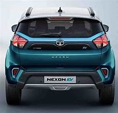
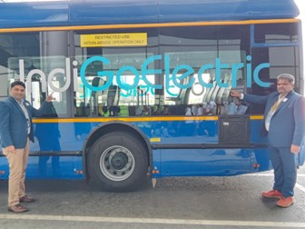
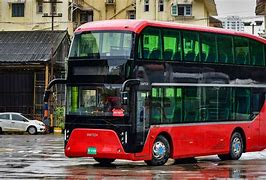

# ELECTRIC VEHICLES (EV), HOW ARE THEY REVOLUTIONIZING INDIAN ROADS.

India has now started revolutionizing Electric Vehicles from
Petrol, diesel, and Compresses Natural Gas (CNG) to build a
greener future, to reduce pollution. Except for these reasons,
there are a few other reasons why EVs are revolutionizing
Indian roads. Since the EVs have come into play, be it
scooter, car, bus, etc. they all have been manufactured and
made in a different style compared to the conventional fuel
and CNG vehicles.

1. All the E-scooters have a digital speedometer.
2. Most of the bikes have some salient features like
navigation, and vehicle-related
documents can be stored on the cloud which can be viewed on the dashboard itself.
3. All the EV buses are Air Conditioned (A/C), including the driver seat.
4. EV buses are introduced in airports to transport the passenges from the terminal to the aircraft and vice versa.
5. And due to the public buses becoming EVs, some people
have started preferring buses over other means of
transport. Like in Mumbai, the old vintage double-decker
buses were scrapped and made way for the new A/C EV
double-decker buses which exactly look like the buses of
London.

  

## Ather EV scooter

## Tata Nexon EV

## Indigo Airlines electric bus at Kempegowda International Airport Bangalore

## Mumbai electric A/C double-decker bus

**Before one decides to go for and electric vehicle**

1. The EV industry is still not fully matured, which means
that there is still not much charging infrastructure and
facilities, mainly in apartments. So, one should consider
before going for an EV as the batteries in most of the EV
are in built and not detachable.
2. There are charging stations being installed in public
places, but they are all fast chargers, so they cannot be
used for regular charging since it will affect the battery. 
3. The price of EVs are always more expensive than fuel
vehicles generally up by 40 %.
