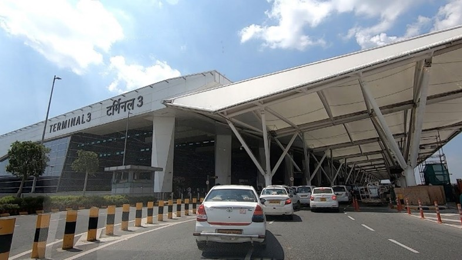

# WHAT MAKES THE TATA AIRLINES STAND OUT
In the Indian aviation industry, 5 airlines operate, i.e. Air India (AI), Air India Express (IX), Akasa Air (QP), Indigo (6E), and Spicejet (SG).

Out of these 5 airlines, 2 airlines are owned by the Tata's i.e., Air India, and Air India Express. Air India and Air India Express have their headquarters in Delhi. Air India is a full-service carrier (FSC) while Air India Express is a budget version of Air India.

There are a few notable features of Tata Airlines that make it stand out compared to other airlines-
These 2 Tata airlines have an interline agreement as they all belong to the Tata's. This makes it easier for a transit passenger to directly transit without exiting and check-in.

Tata Airlines gives a better airport experience than the other Indian airlines even on their domestic routes, especially in Multi Terminal airports in India. This is because they operate their domestic flights from a different terminal from the rest of the Indian airlines, which moves them away from the hustle and bustle of the domestic terminals.

## Here are a few of the multi-terminal airports in India where these Tata airlines operate.
1.	Mumbai (BOM) - The Tata airlines operate their domestic flights from Terminal 2, which is the domestic cum international terminal. In Mumbai, the T2 is superior to the domestic T1 from where only the domestic flights operate, it is superior in many ways like size, infrastructure, design, facilities, amenities, options, etc. Indigo operates some of their flights from T2 in Mumbai as they don't have the space to accommodate all their aircraft in T1 in Mumbai, but Indigo operating their domestic flights from T2 in Mumbai is only temporary.
<figure markdown="span">
  
</figure>

2.	Bangalore (BLR) - The Tata airlines operate their domestic flights from T2 which is the domestic cum international terminal like Mumbai. Unlike Mumbai, in Bangalore Indigo operate their domestic flights completely from T1 as there is a lot of space in Bangalore.

  
 

Kempegowda International Airport (KIA) Bangalore T2

3.	Chennai (MAA) – In Chennai, the Tata Airlines operate their domestic flights from terminal 3 which is the domestic-only terminal for all Tata Airlines. Unlike Mumbai and Bangalore, this terminal 3 does not operate any international flights.

  
  

Chennai International Airport T3

  

4.	Delhi (DEL) – In Delhi, Air India, and Air India Express operate their domestic flights from terminal 3 which is the domestic cum international terminal.

  

Indira Gandhi International Airport (IGIA) Delhi T3

  

5.	Lucknow (LKO) – In Lucknow, the Tata airlines operate from Terminal 2.

  
 

Amausi Airport Lucknow T2

6.	Pune (PNQ) – In Pune, the Tata airlines operate from Terminal 2 which is the newly built terminal.

  
 

Pune Airport T2

