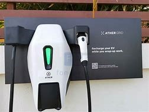

# How does Ather have the best product and services
Ather Energy is an EV startup company that has gone and set new benchmarks in the EV industry.
Ather Energy is owned by Tarun Mehta and Swapnil Jain, who are IIT Chennai products. Their company is based out in Bangalore and they have their factory in a place near Bangalore in Hosur, a place in Tamil Nadu.

  

 Ather energy scooter
 
 

Ather Energy logo

There are various reasons why Ather is a successful e-scooter company, some of them are listed below-
1.	Ather’s model of scooters make them attractive.
2.	Ather has a lot of features that the other e-scooters don’t have.
3.	Ather is the first e-scooter company that has public fast charging stations and neighbourhood charging stations.

Ather grid                          

Ather Neighbourhood

Given below are few of the features which Ather has which other e scooters have not got-
1.	Ather has got a tow and theft detection system in its scooters, so if someone tries to run away with the scooter or tow it, it will alert you.
2.	Ather has got the fall safe feature, so when the scooter falls, the power is automatically cut to the scooter and it alerts the other vehicles.
3.	
Given below are a few of the accessories that Ather provides that no other e scooter provides-
1.	Seat Cover

2.	2.	Throttle grip
3.	Foot mat
4.	Tyre Pressure Monitoring System (TPMS), a nut that is inserted into the tyres of the scooter and gives the status of the tyres.

5.	Frunk, a pouch in the front for storing some essentials like eggs and juice.
6.	Battery protect
7.	Bodyguard
8.	Ather duo

9.	Tyre Inflator

There are a few areas where Ather can still improve-
1.	Ather scooter prices are more as compared to the other e-scooter companies.
2.	The Ather is a bit stiff on their price, they try their best not to reduce their price, while the other e-scooters give discounts.

