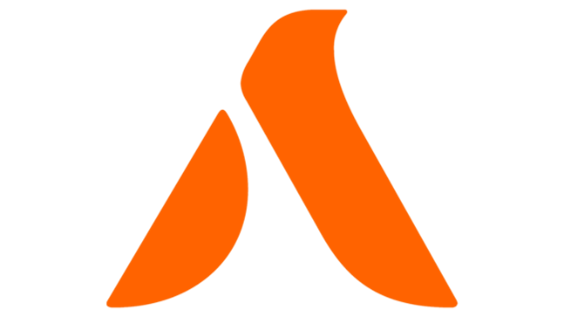
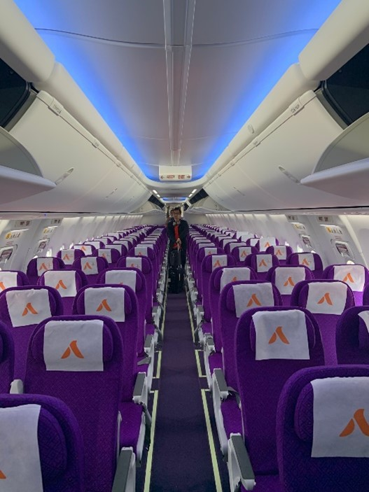
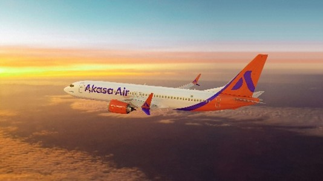

Owned by the late Rakesh Jhunjhunwala, Akasa Air (QP) is an Indian Low-Cost Airline (LCC). Vinay Dube assumed the role of CEO in 2021, and the airline began operations in 2022. The
airline is headquartered in Mumbai and operates out of Bangalore (BLR) and Mumbai (BOM). On August 7, 2022, the airline launched its first route from Mumbai to Ahmedabad (AMD).

Even though they have only been in operation for a year and a half, they have already made a big impression by fiercely competing with some of the leading Indian airlines, like Indigo
, Air India, and Vistara. 

Among the accomplishments that Akasa Air has made in a brief amount of time are:

1.	Running all their airlines exclusively as Boeings.
2.	Their exterior
3.	The standard of their aeroplanes
4.	The only low-cost carrier (LCC) with an A++ class (Business Class) in India

In certain areas, Akasa Air needs to improve.
1. Their cabin personnel must be well-groomed
2. There is a need to improve their customer service
3. The seats should be wider.

All things considered, Akasa Air is a very good airline, somewhat inferior to Vistara (UK) but superior to SpiceJet (SG), Indigo (6E), and Air India (AI) and Air India Express (IX/I5).
