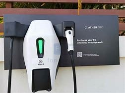

# How and where can India build more public charging stations
India is revolutionizing with EVs at a fast pace, with many E vehicles seen on the road increasing day by day. Since this is happening, there is a need to install more charging stations in public places. There are charging stations installed at various locations across the country, but that is not enough, there need to be more charging points in the country.

Some e-scooter companies like Ather have their charging stations called Ather Grid. It is a fast-charging station for Ather scooters and is interoperable with Hero Vida scooters and vice versa. Ather has neighbourhood chargers that are compatible with all EVs. Ola has started their network of fast charging stations in Bangalore named Ola Hypercharger and slowly expanding across India. Tata has their charging stations in some parts of the country and expanding slowly across the country.

<figure markdown="span">
  
</figure>

<figure markdown="span">
  
</figure>

<figure markdown="span">
  
</figure>

<figure markdown="span">
  
</figure>

<figure markdown="span">
  
</figure>

## Given below are some of the points that can be worked on to build a public charging station
1.	They can have small charging points near some places like petrol pumps. They have it in some of the petrol pumps in Mumbai.
2.	The EV companies can collaborate and share their charging points with other EVs. Like how Ather and Hero Vida share their charging stations.
3.	More amount of public slow charging stations should be built at places like offices and other workspaces.
