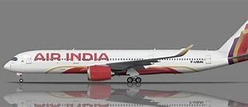
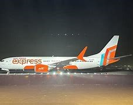

# THE TATA OPERATED AIRLINES
In the Indian aviation industry, there are 5 airlines in total, out of which 2 airlines are owned by Tata. The airlines that are operated by Tata are Air India (AI), and Air India Express (IX). Air India is a Full-service Carrier (FSC) while Air India Express is a Low-Cost Carrier (LCC). Air India and Air India Express have their headquarters in Delhi. Air India operates worldwide while Air India Express operates within Asia for budget travel.

## Some of the notable things about these airlines is that they share the ground services of Tata, as Tata is a very big industry. Here are some of the notable ground operations shared
1.	The stairway is used by Air India for both the airlines.
2.	The luggage vehicle is used by Air India as well for both the airlines.

## There are some areas where they can develop themselves more
They can start using E buses for airside operations as Tatas has the largest EV share in India for large vehicles.
