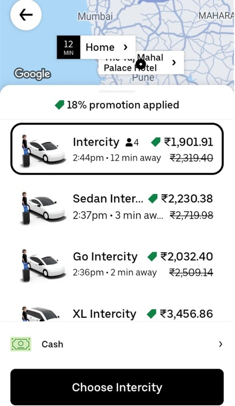
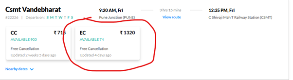

# Vande Bharat Express VS. Intercity Cabs

The Indian domestic travel market has undergone a significant upheaval thanks in large part to Vande Bharat Express. Additionally, the Vande Bharat Express encourages foreign visitors to explore India by rail.
Vande Bharat is a push-pull Electronic Multiple Unit (EMU) train having eight to sixteen coaches. This train may be pulled without the need for a separate locomotive. When traveling through hilly areas like the Western Ghats on the Mumbai-Pune/Mumbai-Nashik route, this train can go without the requirement for back engines. These trains are the quickest and most luxurious in India, and their primary goal is to persuade members of the wealthy and high middle classes to choose rail over road transportation when traveling short distances. This train is given the highest priority.
There exist several benefits of Vande Bharat Express over taxis

1. Despite rising fuel prices, the Vande Bharat Express is less expensive than intercity taxis.
2. Compared to taxis, the Vande Bharat is speedier.
3. Compared to taxis, Vande Bharat offers better legroom and seat reclining.
 
These were a few benefits that Vande Bharat Express offers over taxis.

Nowadays, stats have proved that for popular short-distance routes in India, Vande Bharat is preferred over cabs.

**Here are some of the routes:**

1.  Chennai Central – Mysore Junction
2.	Chennai Central – Coimbatore Junction
3.	Mumbai Central – Gandhinagar Capital
4.	New Delhi – Amb Andaura
5.	Mumbai CSMT – Solapur
6.	Delhi Cantt - Ajmer Junction
7.	Delhi Anand Vihar Terminal – Dehradun
8.	Jaipur Junction – Udaipur City
9.	Mumbai CSMT – Sainagar Shirdi
10.	Delhi Hazrat Nizamuddin – Agra Cantt- Habibganj Bhopal
11.	Chennai Egmore- Tiruchirappalli - Madurai - Tirunelveli
12.	Delhi Anand Vihar Terminal – Ayodhya Cantt Jn
13.	Coimbatore Junction – Bangalore Cantonment
14.	Mangalore Central – Madgaon Junction
15.	Mumbai CSMT – Jalna
16.	New Delhi – Kanpur Central- Varanasi Junction
17.	KSR Bangalore - Dharwad 

**Vande Bharat has a few minor drawbacks over taxis.** 
1. Most Indian train stations are disorganized and unclean.
2. Compared to Vande Bharat Express, taxis are cleaner.

3. Because these are steep and ghat routes, there are increased chances of accidents given their pace if you are traveling from Mumbai to Ahmedabad, Pune, or Nashik during the monsoon. Therefore, since they will be safer, taxis would be a preferable choice for these routes during the monsoon.
 
These were some of the drawbacks of using Vande Bharat instead of taxis.

Overall Vande Bharat is a good initiative by the Indian Railways which has started to increase the profit and the revenue of the Indian Railways and it is a good choice for short-distance (less than 10 hrs) travelers for the rich and upper-class people to prefer over cabs. But not in case of adverse weather conditions, especially in hilly and ghat regions.

